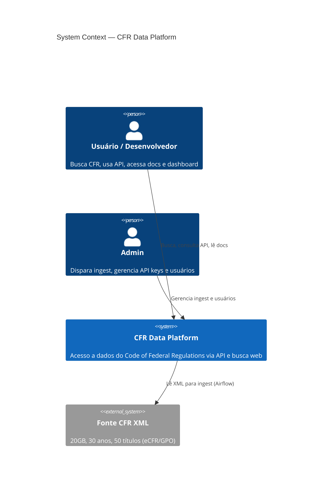
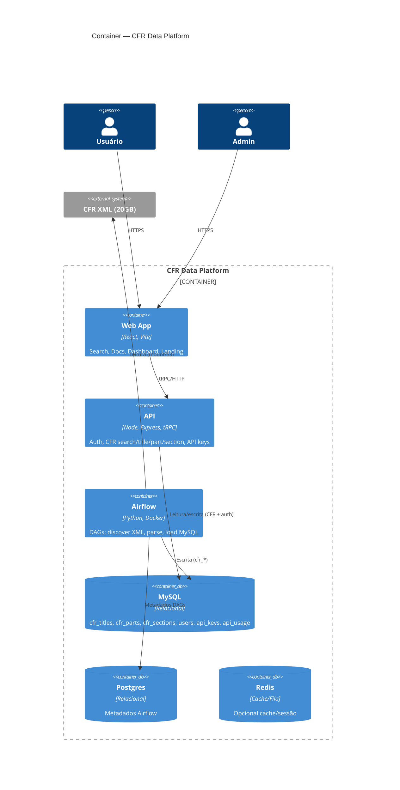
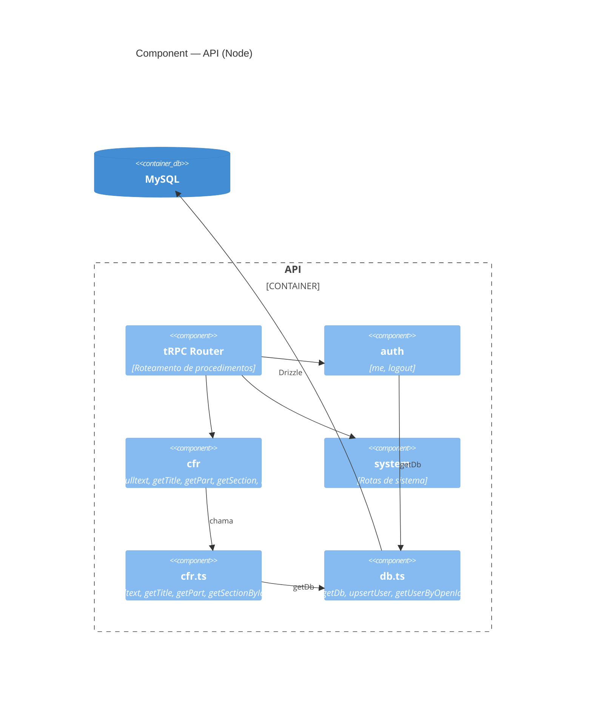
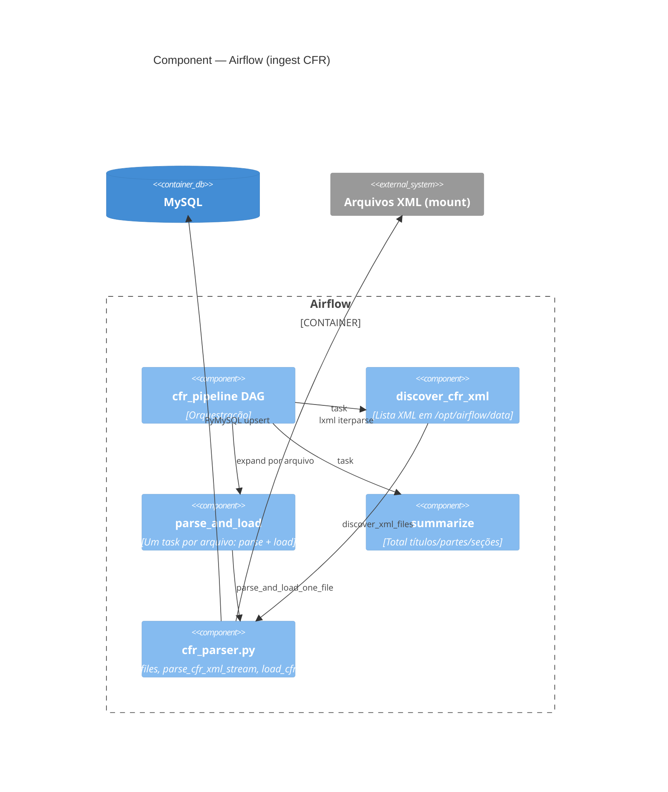
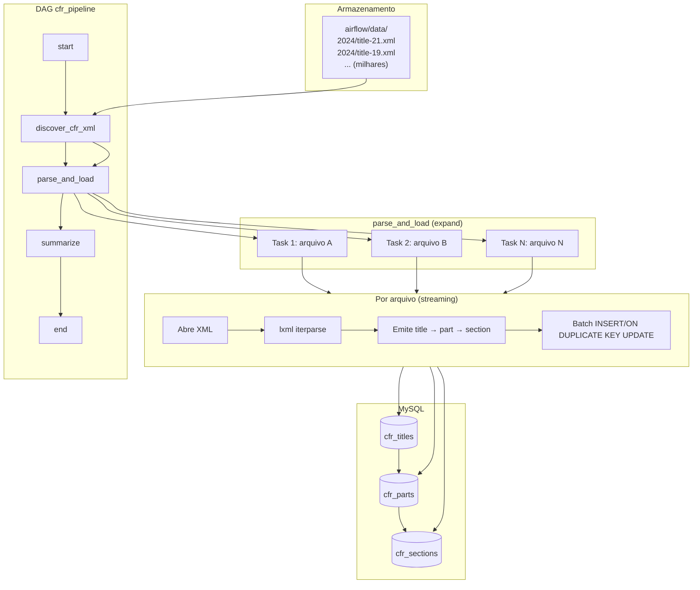
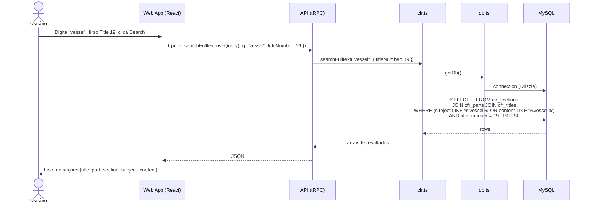
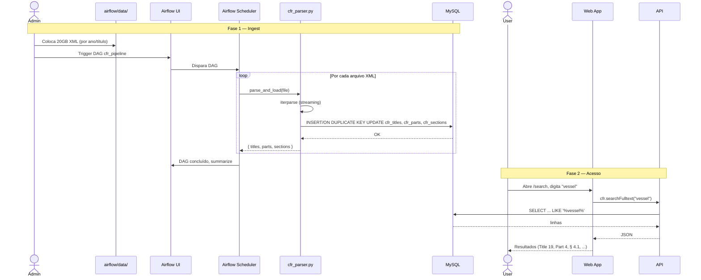
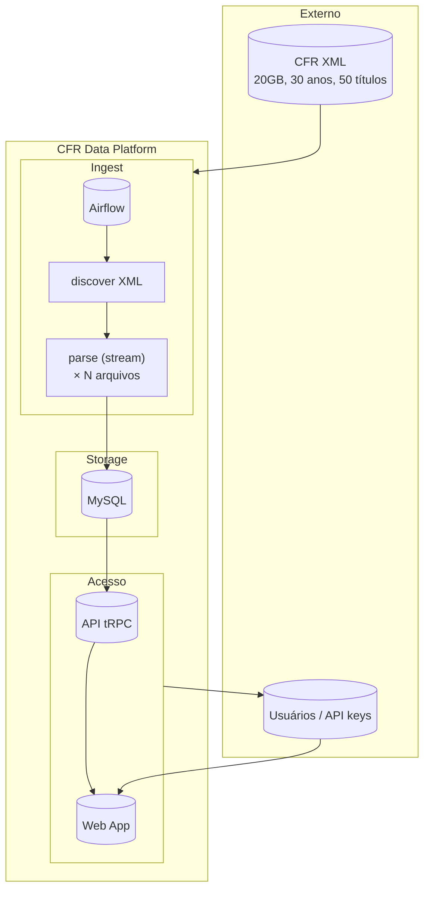

# C4 — CFR Data Platform

Modelo C4 (Context, Container, Component) da arquitetura.

> **Render:** Requer Mermaid com suporte a C4 (ex.: [mermaid.live](https://mermaid.live), VS Code com extensão Mermaid, ou Mermaid 10+). Ver [C4 syntax](https://mermaid.js.org/syntax/c4.html).

---

## Level 1 — System Context

Quem usa o sistema e com quem o sistema se comunica.



**Resumo:** Usuários e admins usam a CFR Data Platform; a plataforma consome XML externo para ingest.

---

## Level 2 — Container

Principais “containers” (aplicações e armazenamentos).



**Resumo:**

| Container   | Tecnologia      | Responsabilidade                                      |
|------------|-----------------|--------------------------------------------------------|
| Web App    | React, Vite     | Search, ApiDocs, Dashboard, Landing                   |
| API        | Node, Express, tRPC | Auth, CFR (search, title, part, section), API keys |
| Airflow    | Python, Docker  | Ingest: discover XML → parse → load MySQL             |
| MySQL      | MySQL           | Dados CFR + usuários, api_keys, api_usage             |
| Postgres   | Postgres        | Metadados Airflow (DAGs, runs)                        |
| Redis      | Redis           | Cache/fila (opcional)                                 |

---

## Level 3 — Component (API)

Componentes principais dentro da API (único ponto de acesso a CFR).



**Resumo:** Todo acesso a CFR passa por `cfr` router → `cfr.ts` → `db` → MySQL.

---

## Level 3 — Component (Airflow)

Componentes do pipeline de ingest.



**Resumo:** DAG descobre XML → um task por arquivo (parser em streaming) → upsert MySQL.

---

## Legenda e convenções

- **Context:** sistema vs pessoas e sistemas externos.
- **Container:** aplicações e bancos (Web App, API, Airflow, MySQL, etc.).
- **Component:** módulos dentro da API e do Airflow.
- **Fonte única de dados CFR:** MySQL; preenchido pelo Airflow; acessado somente pela API.

---

## Referência rápida

| Nível   | O quê |
|--------|--------|
| Context | CFR Data Platform, usuários, admin, fonte XML |
| Container | Web App, API, Airflow, MySQL, Postgres, Redis |
| Component (API) | tRPC, auth, cfr, system, cfr.ts, db.ts |
| Component (Airflow) | cfr_pipeline DAG, discover, parse_and_load, summarize, cfr_parser |

Para diagramas C4 editáveis em ferramentas (Structurizr, draw.io), use os nomes e relações acima.

---

# Diagrama elaborado — Como funciona

Visão detalhada dos fluxos de ingest e de acesso.

---

## 1. Visão geral: dois fluxos principais

```mermaid
flowchart LR
    subgraph INGEST["Pipeline de Ingest (Airflow)"]
        A[CFR XML 20GB<br/>30 anos, 50 títulos] --> B[airflow/data/]
        B --> C[cfr_pipeline DAG]
        C --> D[discover_cfr_xml]
        D --> E[parse_and_load<br/>× 1 task por arquivo]
        E --> F[lxml iterparse<br/>streaming]
        F --> G[PyMySQL upsert]
        G --> H[(MySQL<br/>cfr_titles, cfr_parts, cfr_sections)]
    end

    subgraph ACCESS["Acesso (API)"]
        I[Usuário / API key] --> J[Web App ou cURL]
        J --> K[API tRPC]
        K --> L[cfr.searchFulltext<br/>getTitle, getPart, getSection]
        L --> H
        H --> M[Resposta JSON]
        M --> I
    end

    style H fill:#d4edda
    style A fill:#fff3cd
    style I fill:#cce5ff
```



**Resumo:** À esquerda, o XML é descoberto e processado em streaming (um task por arquivo) e gravado no MySQL. À direita, todo acesso (web ou API) passa pela API, que lê o mesmo MySQL.

---

## 2. Fluxo de ingest (detalhado)

Do disco até as tabelas CFR.



**Resumo:** O DAG lista todos os XML; para cada arquivo é criado um task que faz parse em streaming (sem carregar 20GB em memória) e faz upsert nas três tabelas. Títulos e partes são resolvidos por ID antes de inserir seções.

---

## 3. Fluxo de acesso (busca fulltext)

Do clique do usuário até o resultado.



**Resumo:** A busca é sempre via tRPC; a API chama `cfr.searchFulltext`, que usa Drizzle para consultar as tabelas CFR no MySQL e devolve os resultados para a UI.

---

## 4. Modelo de dados (XML → MySQL)

Como o XML vira linhas nas tabelas.

```mermaid
erDiagram
    cfr_titles ||--o{ cfr_parts : "title_id"
    cfr_parts ||--o{ cfr_sections : "part_id"

    cfr_titles {
        int id PK
        int title_number UK "ex: 19, 21"
        text name "ex: Customs Duties"
        text subject
        int year
        varchar revised_date
    }

    cfr_parts {
        int id PK
        int title_id FK
        int part_number "ex: 4, 7"
        text name
        text subject
        text authority
        text source
    }

    cfr_sections {
        int id PK
        int part_id FK
        varchar section_number "ex: 4.1, 7.1"
        text subject
        text content "texto completo da regra"
    }

    XML_FILE ["XML (por arquivo)"] --> cfr_titles : "parse stream"
    XML_FILE --> cfr_parts : "parse stream"
    XML_FILE --> cfr_sections : "parse stream"
```

**Resumo:** Um XML pode conter um ou mais títulos; cada título tem partes; cada parte tem seções. O parser em streaming emite registros nessa ordem e faz upsert por (title_number), (title_id, part_number), (part_id, section_number).

---

## 5. Sequência completa: primeiro ingest, depois busca



**Resumo:** Primeiro o admin coloca o XML e dispara o DAG; o Airflow processa cada arquivo em streaming e preenche o MySQL. Depois, usuários e API keys acessam os mesmos dados somente pela API (web ou HTTP).

---

## 6. Resumo em um único diagrama



**Resumo:** XML entra no pipeline de ingest (Airflow); o resultado fica no MySQL; todo acesso humano passa pela Web App e pela API, que leem apenas o MySQL.
